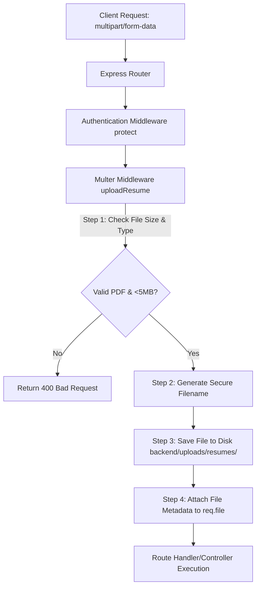

# Phase 7: Resume Upload Middleware using Multer

This phase implemented the resume upload middleware using Multer to handle incoming multipart file uploads, validating PDF file formats and enforcing size constraints safely.

---

## 📂 File Architecture

Below are the new and modified files during this phase:

```
backend/
├── uploads/
│   └── resumes/ (Created dynamically on runtime)
└── src/
    ├── middleware/
    │   └── uploadMiddleware.js (Created)
    └── routes/
        └── authRoutes.js (Modified)
```

---

## 💡 Core Upload Concepts

### 🔄 1. Multer Flow in Express



1. **Request Reception:** Client sends a request with `Content-Type: multipart/form-data` containing the file payload.
2. **Parsing:** Multer intercepts the stream, parses the body fields and files, and runs validation filters.
3. **Execution:**
   - On **Success**, Multer saves the file to the configured disk/cloud storage and attaches metadata details (size, path, original name) to `req.file` before calling `next()`.
   - On **Failure** (e.g., file too large or incorrect type), Multer returns an error to the Express controller, preventing file write.

---

### 🛡️ 2. Security Concerns & Mitigations

*   **Directory Traversal (Path Traversal):**
    *   *Risk:* Attackers manipulate filenames containing traversal sequences (e.g., `../../../etc/passwd` or system files) to overwrite critical server files.
    *   *Mitigation:* We sanitize filenames by stripping out extra dot-traversal sequences and special characters using `.replace(/\.\.+/g, '.')` and regex filters.
*   **Filename Collisions:**
    *   *Risk:* Users uploading files with identical names (e.g., `resume.pdf`) can overwrite each other's data.
    *   *Mitigation:* We generate cryptographically distinct unique suffixes using timestamps and high-entropy random numbers: `${baseName}-${Date.now()}-${randomSuffix}.pdf`.
*   **Unrestricted File Uploads (RCE / XSS):**
    *   *Risk:* Attackers upload malicious executables (e.g., `.js`, `.exe`, `.sh`) or HTML files embedded with malicious scripts (stored XSS).
    *   *Mitigation:* Strict mime-type whitelist checks (`application/pdf`) and file extension checks (`.pdf`) restrict uploads solely to static PDF documents.
*   **Denial of Service (DoS via Large Files):**
    *   *Risk:* Uploading extremely large files (e.g., GBs) can consume all disk space or crash the memory of the server instance.
    *   *Mitigation:* A strict limit of **5MB** (`fileSize: 5 * 1024 * 1024`) is enforced at the Multer level.

---

### ⏳ 3. File Upload Lifecycle

1. **Multipart Connection:** Client opens an HTTP request sending chunks of data.
2. **Boundary Identification:** The parser looks for the boundary markers specified in the `Content-Type` header (e.g. `multipart/form-data; boundary=----WebKitFormBoundary...`) to distinguish text fields from binary payloads.
3. **MIME-Type Inspection:** The header of the file boundary is analyzed to verify MIME-types before streaming the remaining binary payload.
4. **Buffer/Stream Write:** The stream is piped and written directly to the target storage destination on disk.
5. **Request Extension:** Upon complete stream write, Mongoose/Express app logic processes request variables via `req.body` and `req.file`.

---

## 🧪 Testing Guide

Follow these steps to test the resume upload functionality using `cURL` or `Postman`.

### 🏃 Step 1: Start the Server
Make sure you run the Node/Express server:
```bash
cd backend
npm run dev
```

### 🔑 Step 2: Login to Obtain JWT
Login with your candidate account to obtain a token:
```bash
curl -X POST http://localhost:5000/api/auth/login \
  -H "Content-Type: application/json" \
  -d '{"email": "candidate@example.com", "password": "securepassword123"}'
```
*Copy the JWT token.*

---

### 📁 Step 3: Upload a Valid PDF Resume
Ensure you have a sample PDF document (e.g., `my_resume.pdf`) on your system. Run:

```bash
curl -X POST http://localhost:5000/api/auth/profile/resume \
  -H "Authorization: Bearer YOUR_JWT_TOKEN" \
  -F "resume=@/path/to/my_resume.pdf"
```

**Expected Response (`200 OK`):**
```json
{
  "success": true,
  "message": "Resume uploaded successfully",
  "file": {
    "filename": "my_resume-1688569200000-123456789.pdf",
    "path": "D:\\Job-Portal-Devops\\backend\\uploads\\resumes\\my_resume-1688569200000-123456789.pdf",
    "size": 124500
  }
}
```
*Verify that the file was successfully written into `backend/uploads/resumes/`.*

---

### ❌ Step 4: Test Upload Restrictions

#### Test Case A: Uploading an Invalid Format (e.g. `.txt` or `.png`)
```bash
curl -X POST http://localhost:5000/api/auth/profile/resume \
  -H "Authorization: Bearer YOUR_JWT_TOKEN" \
  -F "resume=@/path/to/image.png"
```
**Expected Response (`400 Bad Request`):**
```json
{
  "success": false,
  "message": "Invalid file type. Only PDF resumes are allowed!"
}
```

#### Test Case B: File Size Exceeding 5MB
Ensure you try to upload a file larger than 5MB.
**Expected Response (`400 Bad Request`):**
```json
{
  "success": false,
  "message": "File too large"
}
```

---

## 📬 Testing with Postman

1. **Configure Request:**
   - Create a new request tab, set the HTTP method to **`POST`**, and enter `http://localhost:5000/api/auth/profile/resume`.
2. **Set Authorization:**
   - In the **Authorization** tab, select **Bearer Token** and paste your JWT token.
3. **Set Body to Form-Data:**
   - Go to the **Body** tab, select **form-data**.
   - In the first row, type **`resume`** in the key field.
   - Hover over the key cell, select **File** from the dropdown menu (which changes the input type from text to file).
   - In the value column, click **Select Files** and choose your sample PDF file.
4. **Send & Inspect:**
   - Click **Send**. Verify the output displays a success message, size, and destination path.
