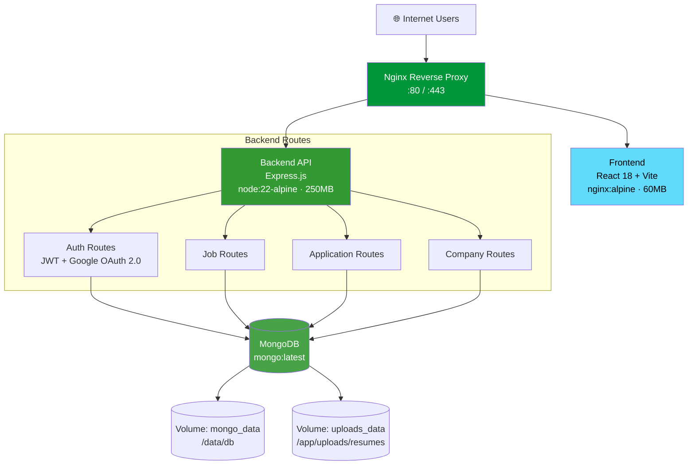
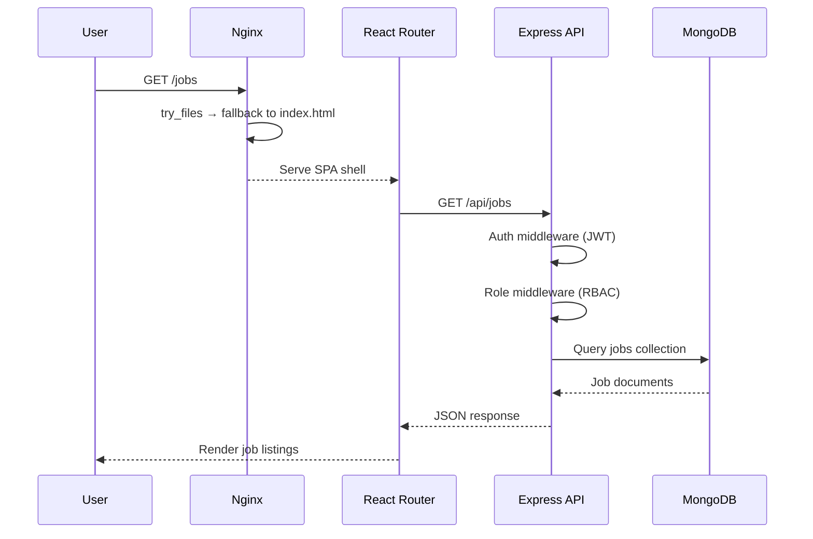
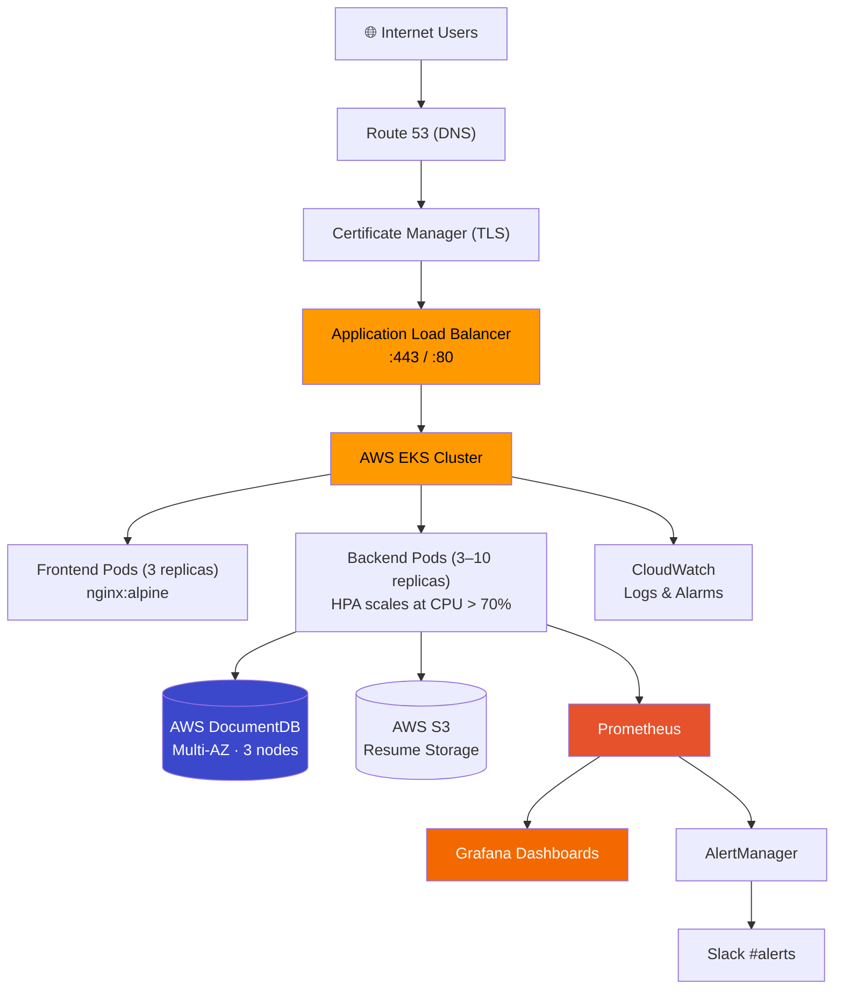

<div align="center">

# 🚀 MERN DevOps Job Portal

**A production-grade, containerized job portal — built to demonstrate real DevOps engineering, not just app development.**

[](#)
[](#)
[](#)
[](#)
[](#)

[](#)
[](#-whats-next-aws-deployment)
[](#)


</div>

---

## 🏗️ Architecture



**Network:** all three services communicate over a shared bridge network (`jobportal-network`), with named volumes for MongoDB data and resume uploads persisting across container restarts.

### Request Lifecycle



---

## ✨ Feature Highlights

<table>
<tr>
<td width="50%" valign="top">

**🔐 Authentication & Authorization**
- JWT-based auth with automatic header injection via Zustand
- Google OAuth 2.0 with smart role detection
- Role-based access control — Candidate / Recruiter / Admin
- Session persistence across refreshes and logout/login cycles

**👥 Multi-Tenant Job Portal**
- **Candidates:** browse, apply with cover letter, track status, manage profile + resume
- **Recruiters:** create company (1-per-recruiter enforced at DB *and* API level), post jobs, review applicants, download resumes
- **Admin:** framework scaffolded for analytics

</td>
<td width="50%" valign="top">

**🐳 Infrastructure & DevOps**
- Multi-stage Docker builds → 8x smaller images
- Nginx SPA routing with `try_files`, 1-year asset caching, gzip
- 3-service Docker Compose network with named persistent volumes
- `/health` and `/ready` endpoints wired for load balancer checks

**🛡️ Security**
- bcrypt password hashing, CORS allow-listing
- Server-side file upload validation
- Nginx security headers (X-Frame-Options, etc.)
- Zero critical vulnerabilities across code & dependencies

</td>
</tr>
</table>

---

## 🧰 Tech Stack

| Layer | Technology | Details |
|---|---|---|
| Frontend | React 18 + Vite | 60MB image, multi-stage build |
| State Management | Zustand | JWT auto-synced across browser tabs |
| API Client | Axios | Interceptor-based auth header injection |
| Backend | Express.js | 250MB image on Alpine Linux |
| Database | MongoDB + Mongoose | Persistent volumes, cascading deletes, schema validation |
| Web / Reverse Proxy | Nginx (Alpine) | SPA routing, gzip, security headers |
| Auth | JWT + bcrypt + Google OAuth 2.0 | Stateless auth, verified OAuth tokens |
| Containerization | Docker + Docker Compose | 3-service orchestrated network |

---

## 🛠️ What I've Built So Far

- **Designed and built the full MERN stack from scratch** — Express REST API, React SPA, MongoDB schemas with Mongoose validation and cascading deletes
- **Implemented JWT + Google OAuth 2.0 auth** with automatic role detection for new vs. returning users
- **Enforced multi-tenancy at both the DB and API layer** — recruiters are hard-scoped to their own jobs and applicants
- **Containerized the entire stack** with multi-stage Docker builds, cutting image sizes by 8x (Alpine base)
- **Configured Nginx as a reverse proxy** — SPA routing with `try_files`, gzip compression, 1-year static asset caching, security headers
- **Orchestrated a 3-service Docker Compose network** with named persistent volumes for MongoDB data and resume uploads
- **Wired health/readiness endpoints** (`/health`, `/ready`) for load-balancer checks
- **Audited dependencies and code for vulnerabilities** — zero critical issues at time of writing

📄 Build notes & issues faced: [`Docs/CONTAINERIZATION.md`](./Docs/CONTAINERIZATION.md), [`Docs/NGINX.md`](./Docs/NGINX.md)

---

## 📊 Performance Snapshot

| Metric | Value | Why It Matters |
|---|---|---|
| Frontend image size | **60MB** | 8x reduction via multi-stage build + Alpine |
| Backend image size | **250MB** | Optimized on Alpine Linux base |
| First load | **~500ms** | Gzip compression + browser caching |
| Repeat load | **~50ms** | Cached static assets |
| API response time | **~100ms** | Indexed MongoDB queries |
| Concurrent users tested | **100+** | Single-container baseline |

---

## 🔌 API Reference

| Endpoint | Method | Purpose |
|---|---|---|
| `/api/auth/register` | `POST` | Register new user |
| `/api/auth/login` | `POST` | Login, returns JWT |
| `/api/auth/profile` | `GET / PUT` | Get or update profile |
| `/api/auth/profile/resume` | `POST` | Upload resume |
| `/api/jobs` | `GET / POST` | List or create jobs |
| `/api/jobs/:id` | `GET / PUT / DELETE` | Single job operations |
| `/api/applications` | `GET / POST` | List or submit applications |
| `/api/companies` | `GET / POST` | Company management (1 per recruiter) |
| `/api/oauth/verify-google-token` | `POST` | Google OAuth verification |

---

## ⚡ Quick Start

**Prerequisites:** Docker & Docker Compose, Git

```bash
git clone https://github.com/AyaanB24/MERN-Devops-Job-Portal.git
cd MERN-Devops-Job-Portal
docker-compose up --build
```

| Service | URL |
|---|---|
| Frontend | http://localhost |
| Backend API | http://localhost:5000 |
| MongoDB | localhost:27017 |

**First run:** open `http://localhost` → register as Candidate or Recruiter → (Candidate) browse jobs & upload a resume, or (Recruiter) create a company and post a job.

---

## 📚 Documentation

- [`CONTAINERIZATION.md`](./Docs/CONTAINERIZATION.md) — Docker setup, issues faced, solutions
- [`NGINX.md`](./Docs/NGINX.md) — SPA routing, caching, security configuration
- [`pipeline_plan.md`](./Docs/pipeline_plan.md) — Full 15-phase CI/CD roadmap

---

## ✅ Deployment Readiness

| Component | Status |
|---|---|
| Frontend (React SPA + Nginx) | ✅ Ready |
| Backend (Express REST API) | ✅ Ready |
| Database (MongoDB, persistent) | ✅ Ready |
| Docker (multi-container orchestration) | ✅ Ready |
| OAuth (Google Sign-In) | ✅ Working |
| Multi-tenancy (DB + API enforced) | ✅ Enforced |
| Profile persistence | ✅ Working |
| Resume upload + preview | ✅ Working |

---

## ☁️ What's Next: AWS Deployment

The current Docker Compose setup runs and demos well locally — the next milestone is taking it to production on **AWS EKS** with CI/CD, observability, and auto-scaling built in.



**Planned pipeline:** Jenkins CI → Trivy/OWASP security scans → Docker Hub registry → Kubernetes manifests (deployments, services, ingress, HPA) → ArgoCD GitOps sync → Prometheus/Grafana observability → deploy to EKS behind an ALB, with Route 53 + ACM for DNS/TLS and CloudWatch for centralized logging and alarms.

📄 Full plan: [`Docs/pipeline_plan.md`](./Docs/pipeline_plan.md)

---

<div align="center">

### 👤 Author

**Ayaan Bargir** — DevOps / Backend Engineer in the making

[](https://github.com/AyaanB24)
[](https://linkedin.com/in/ayaan-bargir-13b684311)
[](mailto:ayaanbargir7@gmail.com)

</div>
