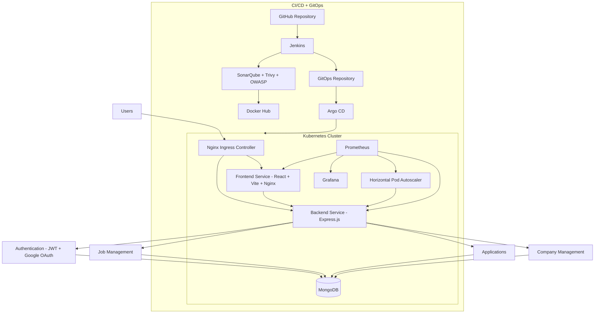
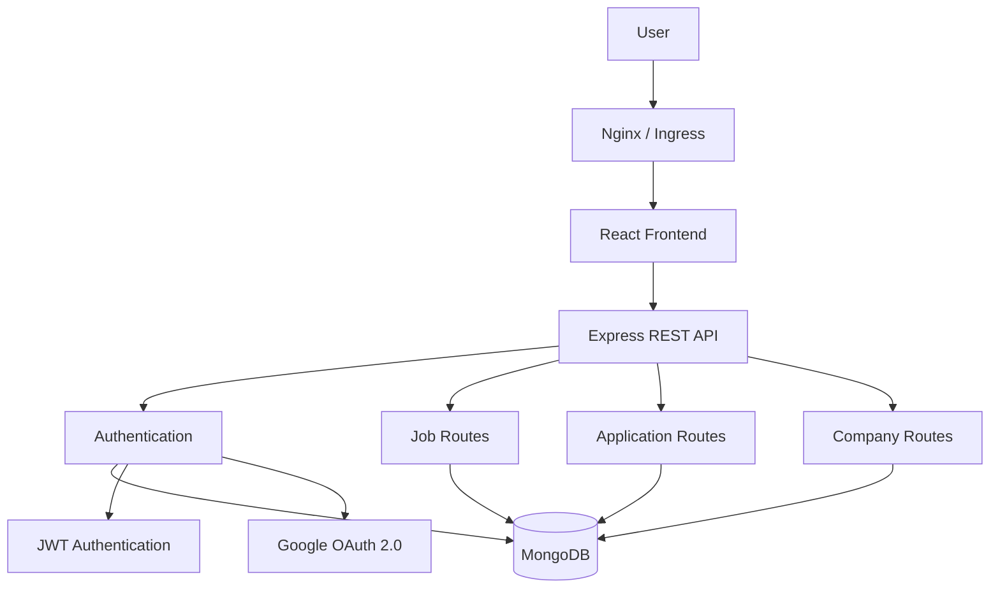
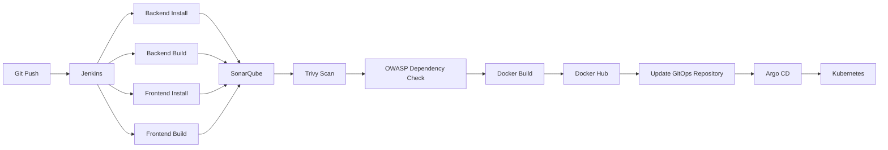
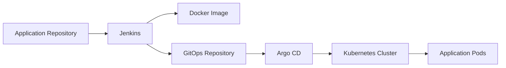
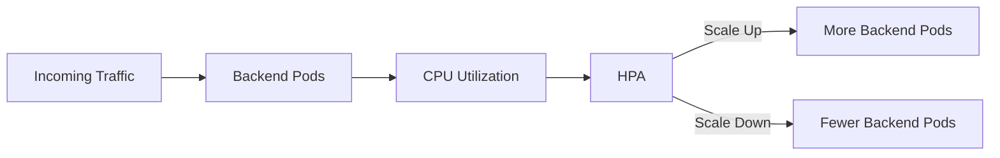
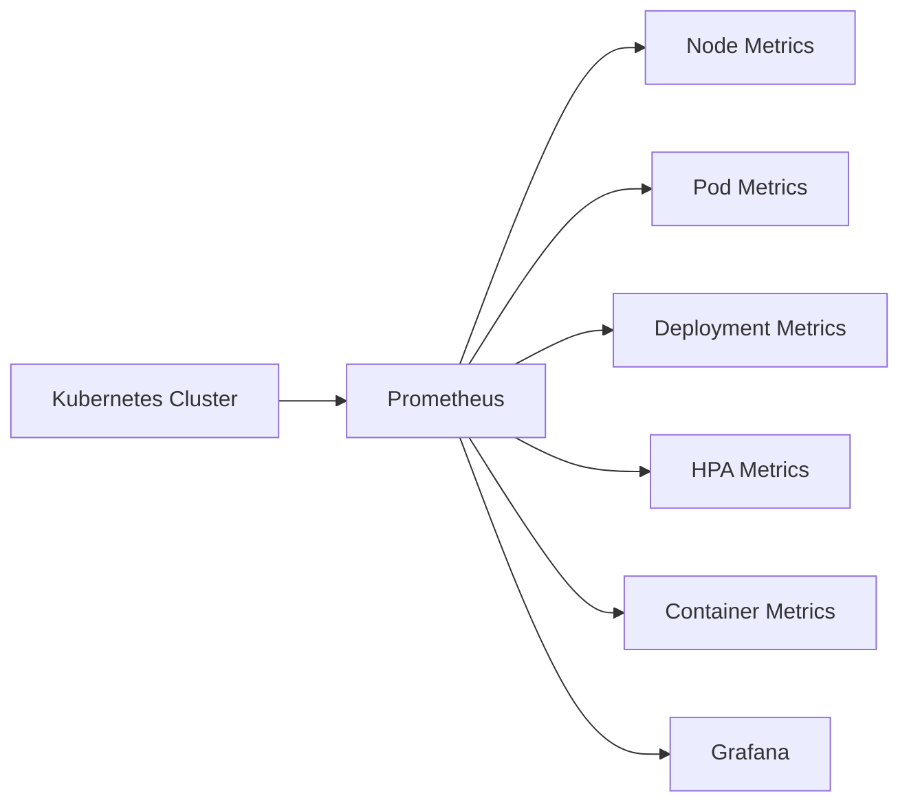
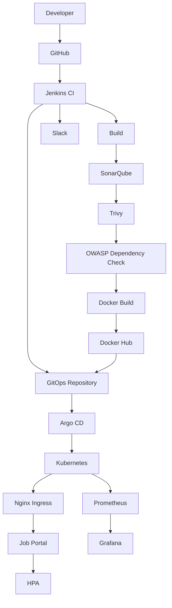

<div align="center">

# DevOps Job Portal

### Production-Grade MERN Application with CI/CD, DevSecOps, GitOps, Kubernetes, Auto Scaling & Observability

A complete end-to-end DevOps implementation of a MERN Job Portal — from application development and containerization to automated security scanning, Kubernetes deployment, GitOps-based delivery, auto-scaling, load testing, and monitoring.


[](#)
[](#)
[](#)
[](#)
[](#)
[](#)

</div>

---

## Overview
 
This project pairs a full-stack MERN job portal with an end-to-end DevOps workflow, covering the full lifecycle from code to a monitored, auto-scaling deployment:
 
```
Development → Containerization → CI (Build + Scan) → Image Registry
→ GitOps Update → Argo CD Sync → Kubernetes Deployment
→ HPA Auto Scaling → Load Testing → Prometheus/Grafana Monitoring
```
 
The deployment has been validated locally on Kubernetes under simulated load, pod failure, and scaling scenarios.
 
---
 
## Architecture
 

 
### Application Flow
 

 
---
 
## Technology Stack
 
| Layer | Technology | Purpose |
|---|---|---|
| Frontend | React 18 + Vite | User interface |
| State Management | Zustand | Client-side state |
| API Client | Axios | Backend communication |
| Backend | Node.js + Express.js | REST API |
| Database | MongoDB + Mongoose | Persistent application data |
| Authentication | JWT | Application authentication |
| OAuth | Google OAuth 2.0 | Social authentication |
| Web Server | Nginx | Frontend serving and reverse proxy |
| Containers | Docker | Application containerization |
| CI/CD | Jenkins | Automated pipeline |
| Code Quality | SonarQube | Static code analysis |
| Security | Trivy | Container vulnerability scanning |
| Dependency Security | OWASP Dependency-Check | Dependency vulnerability analysis |
| Registry | Docker Hub | Container image storage |
| Orchestration | Kubernetes | Application deployment |
| Ingress | Nginx Ingress Controller | External application routing |
| GitOps | Argo CD | Kubernetes deployment automation |
| Scaling | Kubernetes HPA | Automatic pod scaling |
| Load Testing | k6 | Traffic and performance testing |
| Monitoring | Prometheus | Metrics collection |
| Visualization | Grafana | Monitoring dashboards |
| Notifications | Slack | CI/CD notifications |
| Local Cluster | KIND | Kubernetes development environment |
 
---
 
## Application Features
 
**Authentication & Authorization**
- JWT-based authentication with Google OAuth 2.0
- Candidate, Recruiter, and Admin roles with RBAC
- Protected API routes, persistent login sessions
- Secure password hashing using bcrypt
**Candidate Features**
- Browse, search, and apply for jobs
- Submit cover letters and upload resumes
- Track application status and manage profile
**Recruiter Features**
- Create and manage company profile and job postings
- View, review, and manage applicants
- Download candidate resumes
**Application Management**
- End-to-end application status tracking
- Recruiter-specific access control
- Database-level validation
---
 
## DevOps Implementation
 
### 1. Docker Containerization
 
Each service is containerized independently using multi-stage builds to keep runtime images lightweight.
 
```
Frontend  : React + Vite  -> Multi-stage Docker Build -> Nginx Alpine
Backend   : Node.js + Express -> Docker Image -> Node Alpine
MongoDB   : Docker / Kubernetes -> Persistent Volume
```
 
### 2. Jenkins CI/CD Pipeline
 

 
**Pipeline stages:** source checkout → backend install/build → frontend install/build → SonarQube analysis → Quality Gate → Trivy scan → OWASP Dependency-Check → Docker image build → Docker Hub push → GitOps manifest update → Slack notification.
 
### 3. DevSecOps
 
Security is integrated directly into the CI pipeline rather than treated as a separate manual step.
 
- **SonarQube** — code quality, bugs, code smells, maintainability, Quality Gate validation
- **Trivy** — OS, package, and application dependency vulnerability scanning on container images
- **OWASP Dependency-Check** — vulnerable third-party dependency detection
### 4. Docker Image Registry
 
Images are versioned by Jenkins build number for traceability between a build and its deployed version:
 
```
ayaanb2324/jobportal-backend:26
ayaanb2324/jobportal-frontend:26
```
 
### 5. GitOps with Argo CD
 
Jenkins does not directly manage the Kubernetes deployment. It builds and pushes the image, then updates the GitOps repository. Argo CD detects the change and syncs automatically, keeping the desired cluster state in Git.
 

 
### 6. Kubernetes Deployment
 
Runs on a KIND cluster for local production-style testing.
 
- **Services:** `frontend-service`, `backend-service`, `mongo-service`
- **Workloads:** Frontend Deployment, Backend Deployment, MongoDB StatefulSet with Persistent Volume
### 7. Kubernetes Ingress
 
Nginx Ingress Controller exposes the app through a single URL (`http://jobportal.local`) instead of exposing every service individually. Frontend and API traffic are routed internally through the ingress to their respective services.
 
### 8. Horizontal Pod Autoscaling
 

 
Configuration: minimum replicas `2`, maximum replicas `5`, CPU target `60%`.
 
### 9. Load Testing with k6
 
Simulated 100 virtual users hitting `/jobs` through the Kubernetes Ingress to verify response under load, backend scalability, HPA behaviour, pod creation/termination, and availability during scaling.
 
### 10. Failure & Resilience Testing
 
- **Pod failure:** Kubernetes detects the failure → replacement pod is scheduled → service continues routing traffic
- **High load:** HPA detects increased utilization → additional replicas are created → traffic is distributed across pods
### 11. Monitoring with Prometheus
 

 
Tracks node/pod CPU and memory, pod count, deployment status, backend replicas, HPA status, and overall cluster health.
 
### 12. Grafana
 
Dashboards built on Prometheus metrics visualize CPU usage, memory usage, pod count and health, replica count, HPA activity, and cluster resources.
 
### 13. Slack Notifications
 
Jenkins pipeline success and failure events are pushed to Slack for immediate visibility without manually checking Jenkins.
 
---
 
## End-to-End DevOps Flow
 

 
---
 
## Production-Oriented Capabilities
 
| Capability | Status |
|---|---|
| MERN Application | Completed |
| JWT Authentication | Completed |
| Google OAuth | Completed |
| RBAC | Completed |
| MongoDB Persistence | Completed |
| Docker Containerization | Completed |
| Multi-stage Docker Builds | Completed |
| Nginx Configuration | Completed |
| Jenkins CI/CD | Completed |
| SonarQube Analysis | Completed |
| Quality Gate | Completed |
| Trivy Security Scanning | Completed |
| OWASP Dependency Check | Completed |
| Docker Hub Registry | Completed |
| GitOps Repository | Completed |
| Argo CD Automatic Sync | Completed |
| Kubernetes Deployment | Completed |
| Nginx Ingress | Completed |
| Kubernetes HPA | Completed |
| k6 Load Testing | Completed |
| Pod Failure Testing | Completed |
| Prometheus Monitoring | Completed |
| Grafana Dashboards | Completed |
| Slack Notifications | Completed |
 
---
 
## Repository Structure
 
```
MERN-Devops-Job-Portal/
│
├── backend/
│   ├── controllers/
│   ├── middleware/
│   ├── models/
│   ├── routes/
│   ├── services/
│   └── server.js
│
├── frontend/
│   ├── src/
│   ├── public/
│   ├── Dockerfile
│   └── nginx.conf
│
├── k8s/
│   ├── namespace.yaml
│   ├── backend-deployment.yaml
│   ├── backend-service.yaml
│   ├── frontend-deployment.yaml
│   ├── frontend-service.yaml
│   ├── mongo-statefulset.yaml
│   ├── ingress.yaml
│   ├── hpa.yaml
│   └── secrets.yaml
│
├── Docs/
│   ├── CONTAINERIZATION.md
│   ├── NGINX.md
│   └── pipeline_plan.md
│
├── docker-compose.yml
├── Jenkinsfile
└── README.md
```
 
---

## Related Repositories

| Repository | Purpose |
|---|---|
| [MERN-Devops-Job-Portal](https://github.com/AyaanB24/MERN-Devops-Job-Portal) | Application source code + Jenkinsfile (this repo) |
| [jobportal-gitops](https://github.com/AyaanB24/jobportal-gitops) | Kubernetes manifests tracked by Argo CD (deployment source of truth) |

Jenkins builds and pushes the image from this repo, then updates the manifests in `jobportal-gitops`. Argo CD watches that repo and syncs changes to the cluster — this repo never deploys directly.
 
## Local Development
 
**Prerequisites:** Git, Docker Desktop, Docker Compose, KIND, kubectl, Jenkins, Argo CD, k6
 
### Run with Docker Compose
 
```bash
git clone https://github.com/AyaanB24/MERN-Devops-Job-Portal.git
cd MERN-Devops-Job-Portal
docker-compose up --build
```
 
```
Frontend: http://localhost
Backend:  http://localhost:5000
```
 
### Kubernetes Environment
 
```bash
# Create the local cluster
kind create cluster --name jobportal
 
# Verify
kubectl get nodes
 
# Deploy the application through the GitOps workflow, then check resources
kubectl get pods -n jobportal
kubectl get svc -n jobportal
kubectl get ingress -n jobportal
kubectl get hpa -n jobportal
```
 
### Monitoring
 
```bash
kubectl top pods -n jobportal
kubectl get hpa -n jobportal -w
kubectl get pods -n monitoring
```
 
---
 
## Project Outcome
 
This project goes beyond a traditional MERN application by implementing a complete DevOps lifecycle:
 
```
Application (React + Express + MongoDB)
        |
Containerization (Docker + Nginx)
        |
CI / DevSecOps (Jenkins + SonarQube + Trivy + OWASP)
        |
Registry (Docker Hub)
        |
GitOps (GitHub + Argo CD)
        |
Orchestration (Kubernetes + Ingress)
        |
Scalability (HPA + k6 Load Testing)
        |
Observability (Prometheus + Grafana)
```
 
The final result is a containerized, continuously integrated, security-scanned, GitOps-deployed, Kubernetes-orchestrated, auto-scaled, and monitored MERN application.
 
---
 
## Key DevOps Skills Demonstrated
 
Docker containerization, multi-stage builds, Docker networking, Jenkins CI/CD, CI pipeline design, SonarQube, Quality Gates, Trivy, OWASP Dependency-Check, Docker Hub, GitOps, Argo CD, Kubernetes Deployments/Services/Ingress/StatefulSets, Persistent Volumes, Horizontal Pod Autoscaling, Kubernetes self-healing, k6 load testing, Prometheus, Grafana, Slack CI/CD notifications, infrastructure troubleshooting, failure and scalability testing.
 
---
## License
MIT 
 
