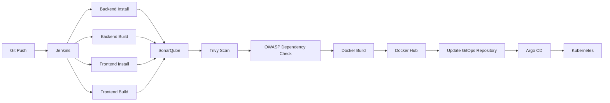
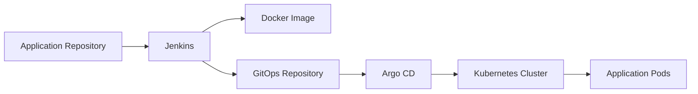
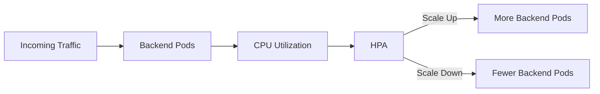
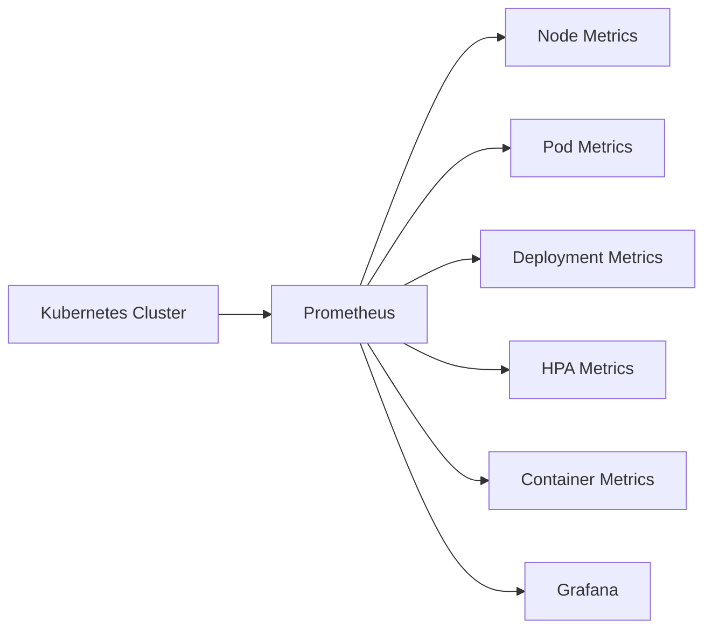
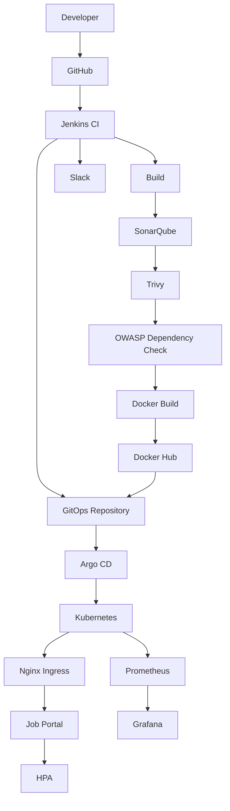

<div align="center">

# MERN DevOps Job Portal

### Production-Grade MERN Application with CI/CD, DevSecOps, GitOps, Kubernetes, Auto Scaling & Observability

A complete end-to-end DevOps implementation of a MERN Job Portal — from application development and containerization to automated security scanning, Kubernetes deployment, GitOps-based delivery, auto-scaling, load testing, and monitoring.

**Project Status: COMPLETED**

[](#)
[](#)
[](#)
[](#)
[](#)
[](#)

</div>

---

## Overview

This project is a full-stack MERN Job Portal built and deployed using a production-oriented DevOps workflow.

The objective was not only to build a functional web application, but to implement the complete software delivery lifecycle — from code to a monitored, auto-scaling Kubernetes deployment:


### 2. Jenkins CI/CD Pipeline



**Pipeline stages:** source checkout → backend install/build → frontend install/build → SonarQube analysis → Quality Gate → Trivy scan → OWASP Dependency-Check → Docker image build → Docker Hub push → GitOps manifest update → Slack notification.

### 3. DevSecOps

Security is integrated directly into the CI pipeline rather than treated as a separate manual step.

- **SonarQube** — code quality, bugs, code smells, maintainability, Quality Gate validation
- **Trivy** — OS, package, and application dependency vulnerability scanning on container images
- **OWASP Dependency-Check** — vulnerable third-party dependency detection

### 4. Docker Image Registry

Images are versioned by Jenkins build number for traceability between a build and its deployed version:


### 5. GitOps with Argo CD

Jenkins does not directly manage the Kubernetes deployment — it builds and pushes the image, then updates the GitOps repository. Argo CD detects the change and syncs automatically, keeping the desired cluster state in Git.



### 6. Kubernetes Deployment

Runs on a KIND cluster for local production-style testing.

- **Services:** `frontend-service`, `backend-service`, `mongo-service`
- **Workloads:** Frontend Deployment, Backend Deployment, MongoDB StatefulSet with Persistent Volume

### 7. Kubernetes Ingress

Nginx Ingress Controller exposes the app through a single URL (`http://jobportal.local`) instead of exposing every service individually. Frontend and API traffic are routed internally through the ingress to their respective services.

### 8. Horizontal Pod Autoscaling



Configuration: min replicas `2`, max replicas `5`, CPU target `60%`.

### 9. Load Testing with k6

Simulated 100 virtual users hitting `/jobs` through the Kubernetes Ingress to verify response under load, backend scalability, HPA behaviour, pod creation/termination, and availability during scaling.

### 10. Failure & Resilience Testing

- **Pod failure:** Kubernetes detects failure → replacement pod → service continues routing traffic
- **High load:** HPA detects increased utilization → additional replicas → traffic distributed across pods

### 11. Monitoring with Prometheus



Tracks node/pod CPU and memory, pod count, deployment status, backend replicas, HPA status, and overall cluster health.

### 12. Grafana

Dashboards built on Prometheus metrics visualize CPU usage, memory usage, pod count and health, replica count, HPA activity, and cluster resources.

### 13. Slack Notifications

Jenkins pipeline success/failure events are pushed to Slack for immediate visibility without manually checking Jenkins.

---

## End-to-End DevOps Flow



---

## Production-Oriented Capabilities

| Capability                 | Status    |
| --------------------------- | ---------- |
| MERN Application            | Completed |
| JWT Authentication          | Completed |
| Google OAuth                | Completed |
| RBAC                          | Completed |
| MongoDB Persistence         | Completed |
| Docker Containerization     | Completed |
| Multi-stage Docker Builds   | Completed |
| Nginx Configuration         | Completed |
| Jenkins CI/CD                | Completed |
| SonarQube Analysis           | Completed |
| Quality Gate                  | Completed |
| Trivy Security Scanning     | Completed |
| OWASP Dependency Check      | Completed |
| Docker Hub Registry          | Completed |
| GitOps Repository             | Completed |
| Argo CD Automatic Sync       | Completed |
| Kubernetes Deployment       | Completed |
| Nginx Ingress                  | Completed |
| Kubernetes HPA                | Completed |
| k6 Load Testing                | Completed |
| Pod Failure Testing           | Completed |
| Prometheus Monitoring       | Completed |
| Grafana Dashboards            | Completed |
| Slack Notifications           | Completed |

---


---

## Local Development

**Prerequisites:** Git, Docker Desktop, Docker Compose, KIND, kubectl, Jenkins, Argo CD, k6

### Run with Docker Compose

```bash
git clone https://github.com/AyaanB24/MERN-Devops-Job-Portal.git
cd MERN-Devops-Job-Portal
docker-compose up --build
```

### Kubernetes Environment

```bash
# Create the local cluster
kind create cluster --name jobportal

# Verify
kubectl get nodes

# Deploy the application through the GitOps workflow, then check resources
kubectl get pods -n jobportal
kubectl get svc -n jobportal
kubectl get ingress -n jobportal
kubectl get hpa -n jobportal
```

### Monitoring

```bash
kubectl top pods -n jobportal
kubectl get hpa -n jobportal -w
kubectl get pods -n monitoring
```

---

## Project Outcome

This project goes beyond a traditional MERN application by implementing a complete DevOps lifecycle:
Application (React + Express + MongoDB)
↓
Containerization (Docker + Nginx)
↓
CI / DevSecOps (Jenkins + SonarQube + Trivy + OWASP)
↓
Registry (Docker Hub)
↓
GitOps (GitHub + Argo CD)
↓
Orchestration (Kubernetes + Ingress)
↓
Scalability (HPA + k6 Load Testing)
↓
Observability (Prometheus + Grafana)


The final result is a **containerized, continuously integrated, security-scanned, GitOps-deployed, Kubernetes-orchestrated, auto-scaled, and monitored MERN application.**

---

## Key DevOps Skills Demonstrated

Docker containerization · Multi-stage builds · Docker networking · Jenkins CI/CD · CI pipeline design · SonarQube · Quality Gates · Trivy · OWASP Dependency-Check · Docker Hub · GitOps · Argo CD · Kubernetes Deployments, Services, Ingress, StatefulSets · Persistent Volumes · Horizontal Pod Autoscaling · Kubernetes self-healing · k6 load testing · Prometheus · Grafana · Slack CI/CD notifications · Infrastructure troubleshooting · Failure and scalability testing

---

## Project Status

<div align="center">

### COMPLETED

**Application · Containerization · CI/CD · DevSecOps · Docker Registry · GitOps · Argo CD · Kubernetes · Ingress · HPA · Load Testing · Prometheus · Grafana**

</div>

---

## Author

<div align="center">

### Ayaan Bargir
**DevOps / Backend Engineer**

[](https://github.com/AyaanB24)
[](https://linkedin.com/in/ayaan-bargir-13b684311)

</div>

---

## License

This project is licensed under the MIT License.
