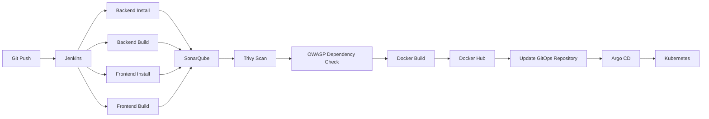

# MERN DevOps Job Portal

### Production-Grade MERN Application with CI/CD, DevSecOps, GitOps, Kubernetes, Auto Scaling & Observability

A complete end-to-end DevOps implementation of a MERN Job Portal — from application development and containerization to automated security scanning, Kubernetes deployment, GitOps-based delivery, auto-scaling, load testing, and monitoring.

**Project Status: COMPLETED**

---

## Overview

This project is a full-stack MERN Job Portal built and deployed using a production-oriented DevOps workflow.

The objective was not only to build a functional web application, but to implement the complete software delivery lifecycle — from code to a monitored, auto-scaling Kubernetes deployment:

### 2. Jenkins CI/CD Pipeline

**Pipeline stages:** source checkout → backend install/build → frontend install/build → SonarQube analysis → Quality Gate → Trivy scan → OWASP Dependency-Check → Docker image build → Docker Hub push → GitOps manifest update → Slack notification.

### 3. DevSecOps

Security is integrated directly into the CI pipeline rather than treated as a separate manual step.

- **SonarQube** — code quality, bugs, code smells, maintainability, Quality Gate validation
- **Trivy** — OS, package, and application dependency vulnerability scanning on container images
- **OWASP Dependency-Check** — vulnerable third-party dependency detection

### 4. Docker Image Registry

Images are versioned by Jenkins build number for traceability between a build and its deployed version:
